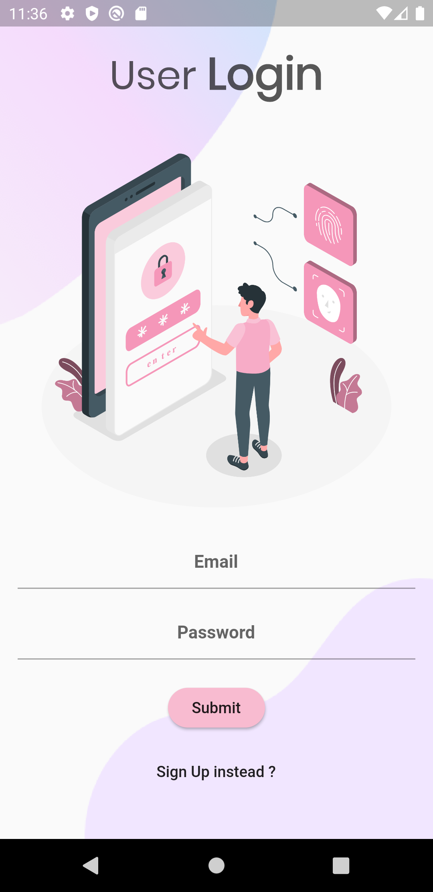
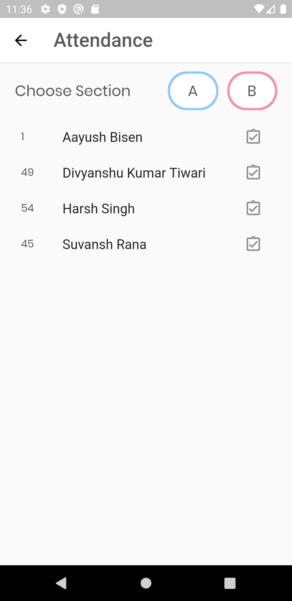

# Campus Connect 

An easy to use online learning platform with features like classrooms, categorized notices, assessments, attendance at one place.

## App Preview

#### Dashboard

    

#### Auth

    
    &nbsp;&nbsp;&nbsp;&nbsp;
    

#### Classroom

    
    &nbsp;&nbsp;&nbsp;
    
    &nbsp;&nbsp;&nbsp;
    

#### Quiz

&nbsp;&nbsp;&nbsp;

&nbsp;&nbsp;&nbsp;

  
#### Notice & Attendance

    
    &nbsp;&nbsp;&nbsp;
    

## Tech Stack

**Client:** Flutter SDK

**Server:** Firebase

  
## Authors

- [Aayush Bisen](https://github.com/aayushbisen)
- [Divyanshu Kumar Tiwari](https://github.com/divyanshukrtiwari)
- [Harsh Singh](https://github.com/harshsngh07)

  
## License

[GNU GPLv3](https://choosealicense.com/licenses/mit/)
